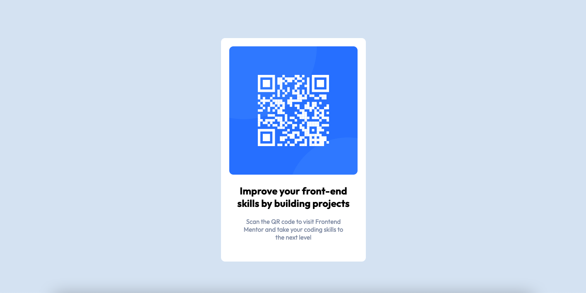

# Frontend Mentor - QR code component solution

This is a solution to the [QR code component challenge on Frontend Mentor](https://www.frontendmentor.io/challenges/qr-code-component-iux_sIO_H). Frontend Mentor challenges help you improve your coding skills by building realistic projects.

## Table of contents

- [Overview](#overview)
  - [The challenge](#the-challenge)
  - [Screenshot](#screenshot)
  - [Links](#links)
- [My process](#my-process)
  - [Built with](#built-with)
  - [What I learned](#what-i-learned)
  - [Continued development](#continued-development)
  - [Useful resources](#useful-resources)
- [Author](#author)
- [Acknowledgments](#acknowledgments)

## Overview

### Screenshot



### Links

- Solution URL: [https://github.com/moussadiakite/qr-code-component](https://github.com/moussadiakite/qr-code-component)
- Live Site URL: [https://moussadiakite.github.io/qr-code-component](https://moussadiakite.github.io/qr-code-component)

## My process

### Built with

- Semantic HTML5
- CSS Media queries
- Flexbox

### What I learned

I learned:
- how to use Semantic HTML5 tags like main and article to better structure my code and make it more accessible.
- by default the size of an h1 title tag can change inside an article tag
- use flexbox to align elements vertically and horizontally

```css
.parent-container {
  display: flex; /* going to use flexbox */
  align-items: center; /* center vertically */
  justify-content: center; /* center horizontally */
}
```

### Continued development

Adding a dark mode.

### Useful resources

- [A complete guide to flexbox](https://css-tricks.com/snippets/css/a-guide-to-flexbox/#aa-flexbox-tricks) - This helped me to understand better flexbox
- [Centering CSS complete guide](https://css-tricks.com/centering-css-complete-guide/) - How to center CSS

## Author

- Website - [Moussa DIAKITE](https://startling-cupcake-1159c8.netlify.app)
- Frontend Mentor - [@moussadiakite](https://www.frontendmentor.io/profile/moussadiakite)

## Acknowledgments

Thanks to Frontend Mentor for proposing this challenge.
